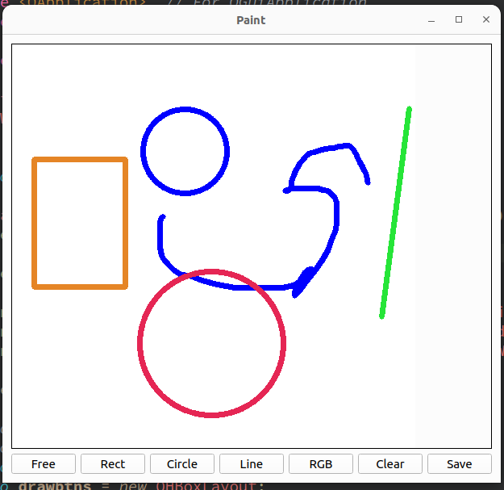
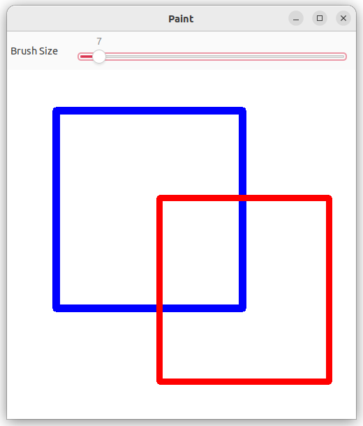
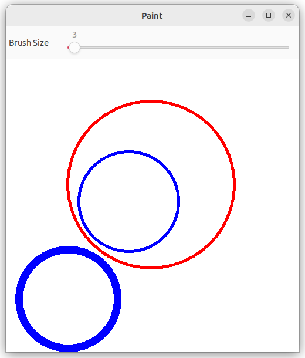

# C++ Paint

## Description

This is an image editor/ paint made on **C++** with [opencv](https://opencv.org/) and *widgets* using *QT*. It will be able to tun on any OS (*currently only Linux =<*). 

## Features

- Drawing using diffent brushes.

- Drawing shapes (such as squares, circles, ect.)
  
  - Each shape tool has it's own brush

- Text writing

- Image editing
  
  - Filters (Blur, grayscale, ect.)

- Others
  
  

## Key commands

`Ctrl + Z` changes to **free drawing**

`Ctrl + Y` changes to the **square tool**

`RGB btn` opens the color picker dialog to **choose a color**

`Tool btn's` changes the **drawing tool** (*Free drawing, rectangles, lines, circles*).

## Setup

If you want to build the project in IDE and run it or make changes.

You need to have [opencv](https://opencv.org/) installed as well as [QT](https://www.qt.io/download).

You can use othe IDE's but the import and build maight differ.

---

## Installation

Download the project or clone it using

```git
gh repo clone kamkanev/Cpp-paint
```

or

```git
git clone https://github.com/kamkanev/Cpp-paint.git
```

##### Linux

You can get doble click on the Paint file or run it using:

```batch
./Paint
```

or you can build it again and then run it:

```batch
qmake
make
./Paint
```

You can also open the project in [Qt](https://www.qt.io/download) and run it from there.

#### Windows and Mac

For now you can only open and run the project in [Qt](https://www.qt.io/download).
